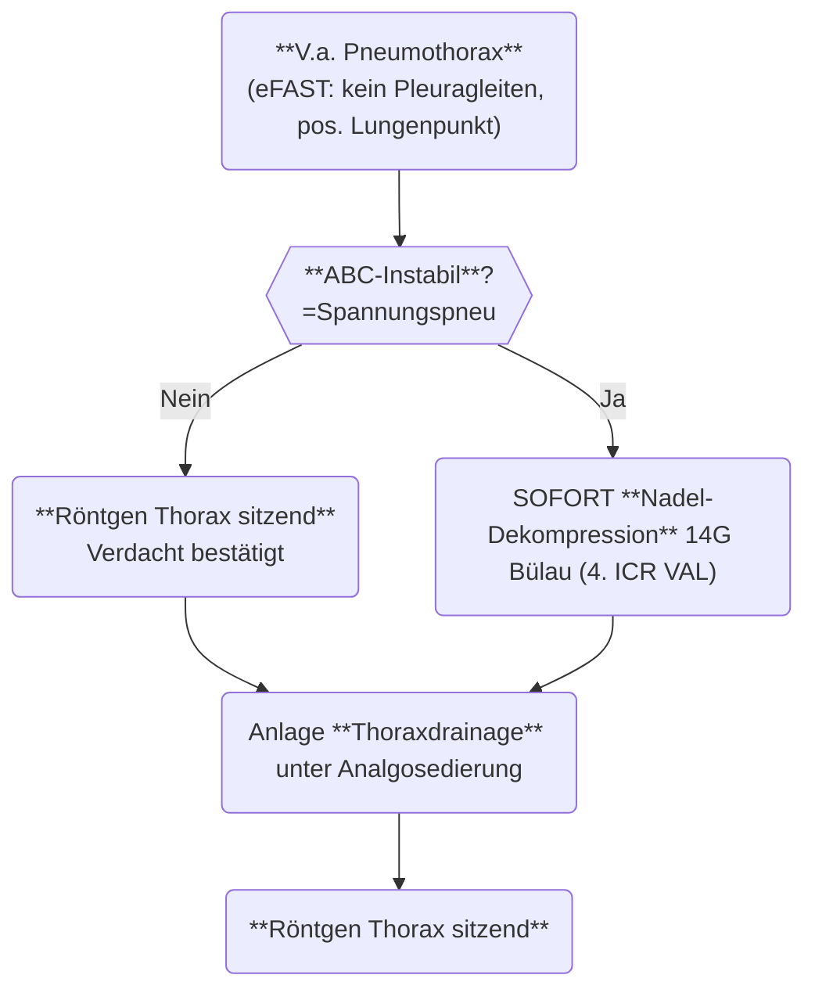

---
tags:
  - Fach/Pneumologie
  - Status/Started
  - Diagnosen
aliases:
  - Pneumothorax
  - Spannungspneumothorax
  - Spannungspneu
title: Pneumothorax inkl. Spannungspneumothorax
ICD: J93
config: 
  theme: 'forest'
  look: 'handDrawn'
---



> [!danger]+ Spannungspneumothorax
> 1. **Arbeitsdiagnose:** Einseitig fehlendes Atemgeräusch + Tubuslage richtig + B-Problem oder C-Problem
> 2. **Nadel-Dekompression** in Bülau (4./5. ICR VAL-MAL) mit spez. Nadel alternativ PVK 14G orange
> 3. **Fingerthorakostomie/[[TDx]]** unter [[Analgosedierung]]

> [!dd]+ Ätiologie
> - **[[Thoraxtrauma|Traumatisch]]:** stumpf/[[CPR]]/[[penetrierend]] → [[TDx]] bei Klinik oder Progress
> - **Iatrogen:** [[ZVK]] 1%, [[RSI]], [[BSK]], [[Beatmung]], Biopsien → wie primärer Spontanpneu
> - **Primärer Spontanpneu:** 
> - **Sekundärer Spontanpneu:**

> [!anamnese]-
> - **S:** Schmerzen? (Belastungs-)[[Dyspnoe]]?
> - **A:** Lokalanästhetika?
> - **M:** [[AK]]?
> - **P:** Jemals Pneu? Lungenerkrankung? Malignom? Z.n. Pleurodese?
> - **L:** Mahlzeit ([[nüchtern]])?
> - **E:** Trauma?
> - **R:** THC? Vaping? Nikotin? Lachgas? Alkohol? Andere Drogen?

> [!workup]-
> - Monitoring
> - **[[POCUS]]** (Sens bis 98%)
> - **[[Labor]]:** [[BGA]], Profil "Synkope"
> - **[[Radiologie]]:** [[Rö Tx]] ==stehend== zur Größenbeurteilung (liegend Sens ≈60%)

> [!stadien]- Größeneinteilung Pneumothorax
> - **Klein** <2 cm Dehiszenz auf Hilus-Höhe
> - **Groß** >2 cm Dehiszenz auf Hilus-Höhe
> - *Amerikanische Guidelines:* Cutoff 3 cm apikale Dehiszenz (weniger praktikabel)

![[iss#^1eb208]]

![[iss#^4a75cf]]

> [!management]-
> - **Disposition:** 

> [!note]- Textbaustein Spontanpneu Ambulant
> ```
> Aktuell: Primärer Spontanpneumothorax
> 
> Zusammenfassend primärer Spontanpneumothorax RECHTS/LINKS (ca. ### cm hiläre Dehiszenz). Überwachung über 4 Stunden mit unauffälligem Verlauf, abschließend in stehender Röntgen-Kontrolle Größenprogress ausgeschlossen.
> 
> Bei tolerablem Schmerzniveau, unter Raumluft stabilem Gasaustausch, problemloser Mobilisation ohne schwere Dyspnoe, gesicherter häuslicher Versorgung und im Einklang mit dem Patientenwunsch konservatives Procedere. Entlassung in gutem AZ bei stabilen VP nach ausführlicher Aufklärung.
> 
> Empfehlungen: 
> - Sofortige Wiedervorstellung über eine Notaufnahme bei verstärkter Luftnot, unzureichend kontrollierten Schmerzen oder Kreislaufbeschwerden 
> - Verlaufskontrolle bei der Hausärztin in 2-3 Tagen 
> - konsequenter Nikotin- und (inhalativer) THC-Verzicht! 
> - ANALGESIE
> ```

## Literatur
- Pigtail vs. TDx oft ausreichend bei Stabilität und kleiner bronchopulmonaler Fistel[^1]
- Konservative Therapie für Primären Spontanpneumothorax unter bestimmten Umständen ok[^2]

[^1]: Kulvatunyou N, Erickson L, Vijayasekaran A, Gries L, Joseph B, Friese RF, O'Keeffe T, Tang AL, Wynne JL, Rhee P. Randomized clinical trial of pigtail catheter versus chest tube in injured patients with uncomplicated traumatic pneumothorax. Br J Surg. 2014 Jan;101(2):17-22. doi: 10.1002/bjs.9377. PMID: 24375295.

[^2]: [Brown et al: Conservative versus Interventional Treatment for Spontaneous Pneumothorax, NEJM 2020](https://www.nejm.org/doi/full/10.1056/NEJMoa1910775)
